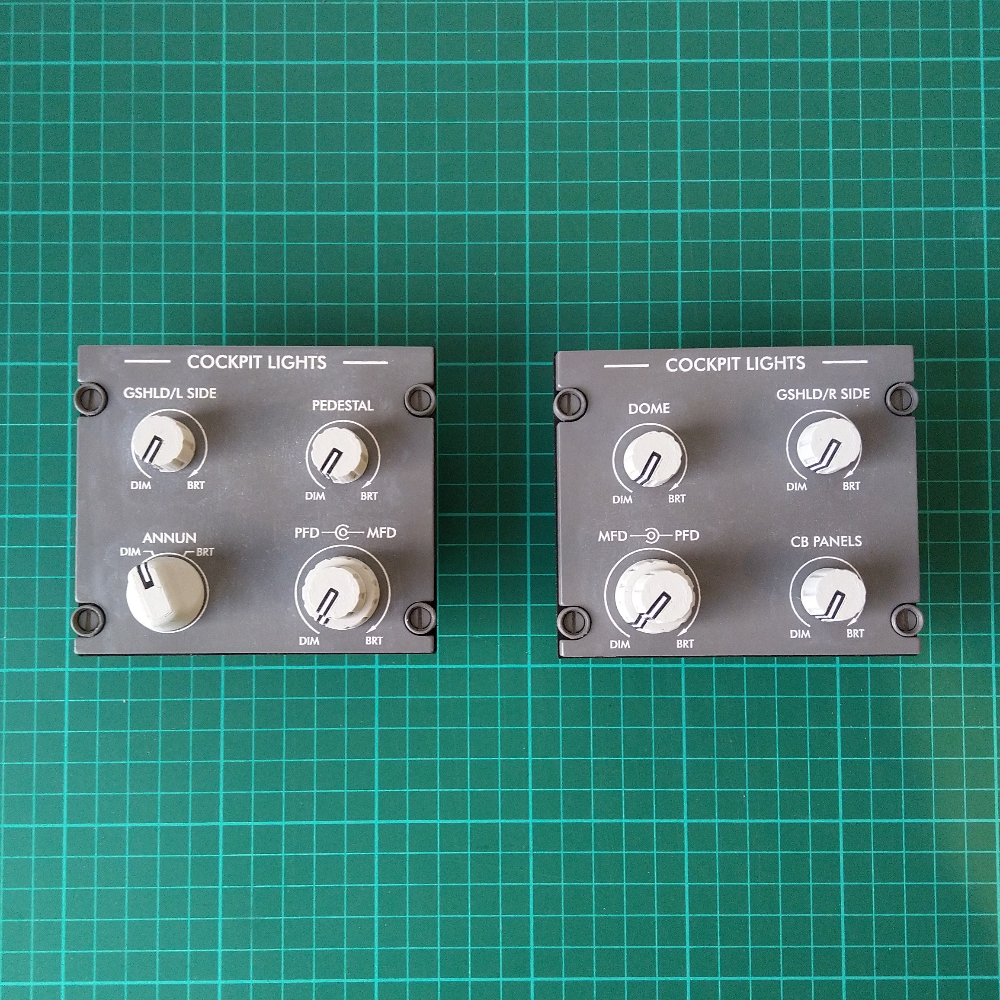

# challenger_300_cockpit_lights
COCKPIT LIGHTS panels for Challenger 300

DXF files for making the panels. Pilot panel requires one dual concentric potentiometer, two regular potentiometers, and one SR16 2-pos rotary
switch. Also, OpenSCAD files for producing knobs.

Arduino code to interface with X-Plane is included.

